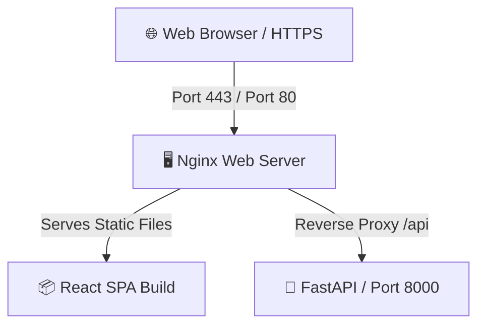

# 🚀 AWS Production Deployment Guide (React + FastAPI)

This guide provides step-by-step instructions to deploy your **GeoEvents AI** application on a single **AWS EC2 (Ubuntu 22.04 LTS)** instance using **Nginx** (as a web server and reverse proxy) and **Systemd/Uvicorn** (for backend process management).

---

## 🏗️ Architecture Overview



*   **Frontend**: React (Vite) built to static HTML/JS/CSS assets, served directly by **Nginx** (ultra-fast and secure).
*   **Backend**: FastAPI running inside a Python virtual environment, managed by **Systemd** (with auto-restart on failures), listening locally on port `8000`.

---

## 🛠️ Step 1: Launch and Configure AWS EC2 Instance

1.  **Launch EC2 Instance**:
    *   Go to **AWS EC2 Console** -> **Launch Instance**.
    *   **OS**: Choose **Ubuntu Server 22.04 LTS (HVM)** (64-bit x86).
    *   **Instance Type**: `t3.medium` (recommended) or `t3.micro` (free tier eligible, but compile builds slowly).
    *   **Key Pair**: Create or choose an existing `.pem` key pair for SSH access.
2.  **Configure Security Group (Firewall)**:
    Add the following **Inbound Rules**:
    *   `SSH` (Port 22): Source `My IP` (for secure server access).
    *   `HTTP` (Port 80): Source `0.0.0.0/0` (anywhere).
    *   `HTTPS` (Port 443): Source `0.0.0.0/0` (anywhere).

---

## 📂 Step 2: Connect to Server and Install Dependencies

Open your terminal (PowerShell or Git Bash) on your local machine and connect to your instance:

```bash
ssh -i /path/to/your-key.pem ubuntu@your-ec2-public-ip
```

Once connected, run the following commands to update the system and install required system tools (Python, Node.js, Nginx, Certbot):

```bash
# Update Ubuntu package manager
sudo apt update && sudo apt upgrade -y

# Install Python 3, virtual environment, and pip
sudo apt install -y python3-pip python3-venv python3-dev

# Install Node.js (v18+) & NPM for building the frontend
curl -fsSL https://deb.nodesource.com/setup_18.x | sudo -E bash -
sudo apt install -y nodejs

# Install Nginx (Web Server) & Git
sudo apt install -y nginx git certbot python3-certbot-nginx
```

---

## 🐍 Step 3: Deploy the FastAPI Backend

1.  **Clone the Repository**:
    ```bash
    git clone <your-github-repo-url> /var/www/location-based
    cd /var/www/location-based/backend
    ```
2.  **Create and Activate Virtual Environment**:
    ```bash
    python3 -m venv venv
    source venv/bin/activate
    ```
3.  **Install Requirements**:
    Ensure your `requirements.txt` is updated. Install dependencies:
    ```bash
    pip install --upgrade pip
    pip install -r requirements.txt
    ```
4.  **Configure Environment Variables**:
    Create a production `.env` file:
    ```bash
    nano .env
    ```
    Add your production API keys and configure port settings:
    ```env
    WEATHER_API_KEY=your_openweathermap_api_key
    SERP_API_KEY=your_serpapi_key
    GEMINI_API_KEY=your_gemini_api_key
    GEOAPIFY_KEY=your_geoapify_api_key
    PORT=8000
    ```
    *(Press `Ctrl+O` then `Enter` to save, and `Ctrl+X` to exit nano)*

5.  **Configure Systemd Service for Process Persistence**:
    To ensure Uvicorn runs 24/7 in the background and restarts if the server reboots or crashes, create a system service file:
    ```bash
    sudo nano /etc/systemd/system/fastapi.service
    ```
    Paste the following configuration:
    ```ini
    [Unit]
    Description=FastAPI Application
    After=network.target

    [Service]
    User=ubuntu
    WorkingDirectory=/var/www/location-based/backend
    ExecStart=/var/www/location-based/backend/venv/bin/uvicorn app.main:app --host 127.0.0.1 --port 8000 --workers 4
    Restart=always
    EnvironmentFile=/var/www/location-based/backend/.env

    [Install]
    WantedBy=multi-user.target
    ```
    Save and close the file.

6.  **Start and Enable Backend Service**:
    ```bash
    sudo systemctl daemon-reload
    sudo systemctl start fastapi
    sudo systemctl enable fastapi
    ```
    Verify it is running successfully:
    ```bash
    sudo systemctl status fastapi
    ```

---

## 📦 Step 4: Build and Deploy the React Frontend

1.  **Navigate to Frontend Directory**:
    ```bash
    cd /var/www/location-based/frontend
    ```
2.  **Install NPM packages**:
    ```bash
    npm install
    ```
3.  **Build the Production Static Bundle**:
    Vite will compile and optimize all React, JS, and CSS files into a high-performance `dist` directory.
    ```bash
    npm run build
    ```
4.  **Confirm the build output**:
    Verify that the build generated a `dist` directory:
    ```bash
    ls -la dist/
    ```

---

## 🖥️ Step 5: Configure Nginx as Web Server & Reverse Proxy

Nginx will serve the React static files directly for maximum speed and forward any `/api` routes to your local FastAPI backend server on port `8000`.

1.  **Create Nginx Configuration File**:
    ```bash
    sudo nano /etc/nginx/sites-available/location-based
    ```
2.  **Paste Nginx configuration**:
    Replace `your-domain.com` with your actual domain or EC2 Public IP address:
    ```nginx
    server {
        listen 80;
        server_name your-domain.com www.your-domain.com;

        # React Static Assets
        location / {
            root /var/www/location-based/frontend/dist;
            index index.html;
            try_files $uri $uri/ /index.html;
        }

        # Reverse Proxy to FastAPI Backend
        location /api/ {
            proxy_pass http://127.0.0.1:8000/api/;
            proxy_http_version 1.1;
            proxy_set_header Upgrade $http_upgrade;
            proxy_set_header Connection 'upgrade';
            proxy_set_header Host $host;
            proxy_cache_bypass $http_upgrade;
            proxy_set_header X-Real-IP $remote_addr;
            proxy_set_header X-Forwarded-For $proxy_add_x_forwarded_for;
            proxy_set_header X-Forwarded-Proto $scheme;
        }

        # Optimize static asset caching
        location ~* \.(?:css|js|jpg|jpeg|gif|png|ico|cur|gz|svg|svgz|mp4|ogg|ogv|webm|htc)$ {
            root /var/www/location-based/frontend/dist;
            expires 1M;
            access_log off;
            add_header Cache-Control "public";
        }
    }
    ```
3.  **Enable Configuration & Restart Nginx**:
    ```bash
    # Link to enabled sites
    sudo ln -s /etc/nginx/sites-available/location-based /etc/nginx/sites-enabled/
    
    # Remove default Nginx welcome page config
    sudo rm /etc/nginx/sites-enabled/default
    
    # Test Nginx syntax for errors
    sudo nginx -t
    
    # Restart Nginx service
    sudo systemctl restart nginx
    ```

---

## 🔒 Step 6: Secure with Free HTTPS/SSL (Certbot)

To protect user searches and locations, configure free SSL certificates with Let's Encrypt:

1.  Ensure your domain’s DNS (e.g. `your-domain.com`) points to your **EC2 Public IP Address**.
2.  Run Certbot to fetch and auto-configure SSL for Nginx:
    ```bash
    sudo certbot --nginx -d your-domain.com -d www.your-domain.com
    ```
3.  Follow the prompts. Certbot will automatically rewrite your Nginx configuration to support HTTPS and redirect HTTP traffic to HTTPS safely.

---

## 🛠️ Step 7: Post-Deployment Logs and Troubleshooting

### View Backend Live Logs:
```bash
sudo journalctl -u fastapi -f
```

### View Nginx Error Logs:
```bash
sudo tail -f /var/log/nginx/error.log
```

### Restart Backend after Code Updates:
Whenever you pull updates or make changes to the backend codebase, restart the service:
```bash
sudo systemctl restart fastapi
```

---

**🎉 Congratulations! Your production-grade React + FastAPI application is now live on AWS EC2 with full SSL security, background process monitoring, and optimized static serving!**
